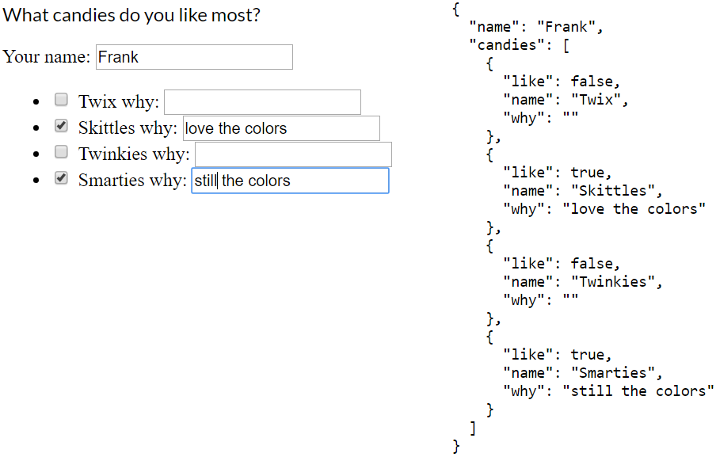

### Dynamic input fields

Input fields that are dynamic are a bit special in Angular.

```html
<form [formGroup]="candyForm">
    <p>What candies do you like most?</p>

    Your name: <input formControlName="name">
    <ul>
		<li *ngFor="let c of candies">
			<input type="checkbox" formControlName="...??">
            {{c.name}}
            why: 
            <input type="text" formControlName="...??">
		</li>
    </ul>

    <pre>{{candyForm.value | json}}</pre>
</form>
```

---

### Dynamic input fields

What we want, is values to be bound like this:



<!-- .element style="max-width: 700px;" -->

---

### Dynamic input fields

For these scenarios, `formArrayName` is designed to help you bind to the corrected values.

```html
<form [formGroup]="candyForm">
    <p>What candies do you like most?</p>

    Your name: <input formControlName="name">
    <ul formArrayName="candies">
      <li *ngFor="let c of candies; let i = index" [formGroupName]="i">
        <input type="checkbox" formControlName="like">
              {{c.name}}
              why: 
              <input type="text" formControlName="why">
      </li>
    </ul>

    <pre>{{candyForm.value | json}}</pre>
</form>
```

---

### Dynamic input fields

Because you're databinding to specific indexes in the array, those items need to exist. Every candy needs to have a representation in the form definition.

```ts
this.candies = [
    { name: 'Twix' }, { name: 'Skittles' },
    { name: 'Twinkies' }, { name: 'Smarties' }
];

let formCandies: FormGroup[] = [];
for (let c of this.candies) {
    formCandies.push(this.fb.group({
        like: false,
        name: c.name,
        why: ''
    }));
}

this.candyForm = this.fb.group({
    name: [''],
    candies: this.fb.array(formCandies)
});
```

<!-- .element class="small" -->