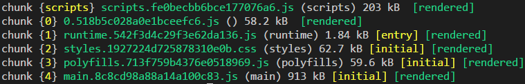

### Lazy load routes

Angular supports lazy loading routes through the `loadChildren` property, thus shortening initial load time.

```ts
export const routes: Routes = [
	{
		path: 'admin',
		loadChildren: './admin/admin.module#AdminModule',
		canLoad: [AdminAuthGuard]
	},
];
```

and define the subroutes using `RouterModule.forChild()`.

```ts
@NgModule({
    imports: [
        RouterModule.forChild(adminRoutes),
    ],
})
export class AdminModule { }
```

---

### Lazy loud routes

If configured correctly, running a build with `ng build` should also generate a separate chunk.

